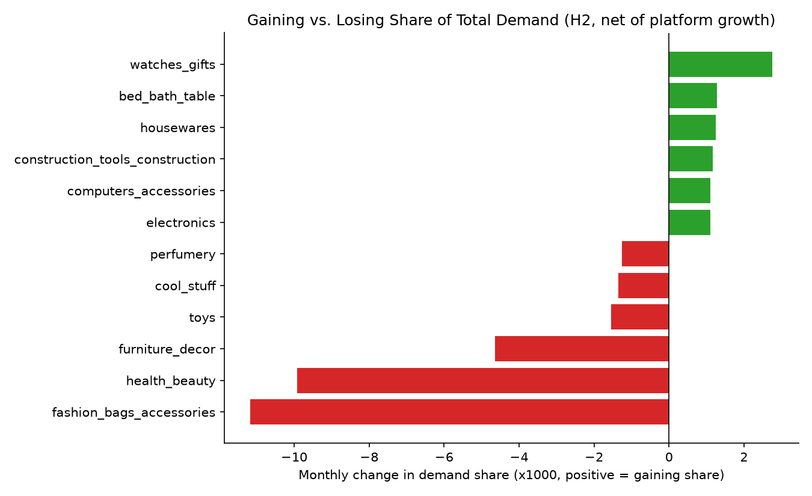
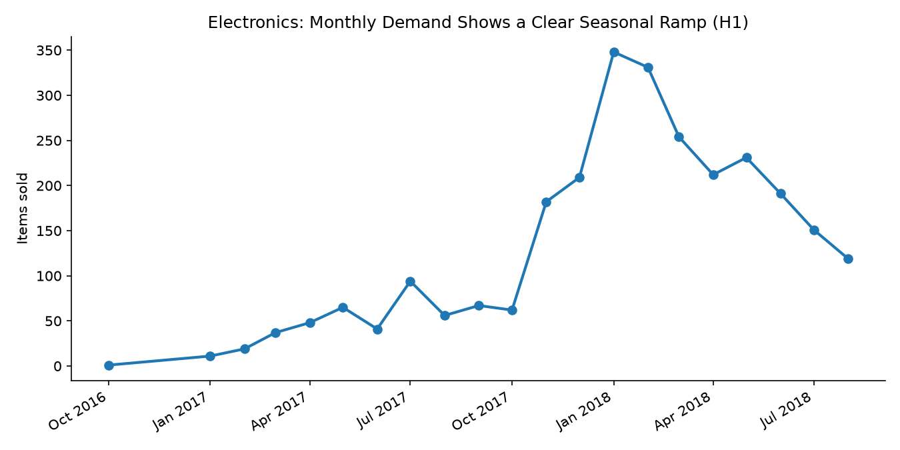

# Consignment/Resale Sell-Through & Timing Analytics

**A hypothesis-driven demo build**, framed as the question a resale/consignment operator (à la TheRealReal) actually asks: *what's selling, when should we sell it, and when should we be buying it?* Every finding below started as a stated hypothesis (see [HYPOTHESES.md](HYPOTHESES.md)), was tested against real transaction data, and closed with a decision — not a chart in search of a story.

## The business question

> "What is selling, when should we sell what, and when should we buy what?"

## Approach: hypothesis → test → decision

| # | Hypothesis | Result | Decision |
|---|---|---|---|
| H1 | Category demand is seasonal, not flat | **Confirmed** — demand volatility (CV) ranges 0.42–0.65 across top categories; `electronics` shows a clear Nov–Feb ramp (holiday season) | Build category-specific buy calendars, not one blanket cadence |
| H2 | Some categories are structurally growing/shrinking, independent of season | **Confirmed, but only after correcting for a confound** (see below) — `watches_gifts` is gaining real share of demand; `fashion_bags_accessories` and `health_beauty` are losing share despite raw volume looking flat-to-up | Weight buy volume toward share-gaining categories now, before it shows up in raw sales; flag share-losing categories for markdown, not restock |
| H3 | Faster delivery predicts higher customer satisfaction | **Confirmed** — review score drops from 4.36 (0–5 day delivery) to 3.13 (21+ days), R² = 0.1085, delivery_days coefficient significant at p < 0.001 | Delivery-speed investment is a justified demand-side lever, not just a cost center |

## The confound I caught before reporting H2

The first pass at H2 used raw item-count trend per category and nearly every category showed "growth" — because Olist's total order volume grew substantially over the dataset's timeframe, so almost anything trends up in raw terms. That's not category-specific signal, it's platform growth leaking into every number. I re-ran H2 on each category's **share of total monthly demand** instead, which isolates real relative winners and losers:

- `health_beauty` looked like the *strongest raw grower* (steepest raw slope) but is actually **losing share** once platform growth is netted out — its raw growth is just riding the marketplace's overall expansion, not outperforming it.
- `watches_gifts` is the real structural winner (R² = 0.80 on its share trend — a genuinely strong, clean signal, not noise).

This is the difference between a dashboard number and an analysis: the confound doesn't show up unless you go looking for it, and reporting it (rather than the more impressive-looking raw number) is the point.




## What I'd do next as the analytics lead

1. **Buy calendar by category**, not SKU-by-SKU: seed it with the top-10 categories' seasonality curves (H1), starting with `electronics` and `bed_bath_table` where the seasonal signal is strongest and highest-volume.
2. **Shift acquisition weight toward `watches_gifts`-type categories**: real share growth (R² = 0.80) is a leading indicator, not a lagging one — the point of catching it now is acting before it's obvious in raw sales.
3. **Open a markdown/exit review on `fashion_bags_accessories` and `health_beauty`**: losing share despite decent raw volume is exactly the pattern that gets missed if you only watch raw numbers — worth a pricing or sourcing-mix conversation before it compounds.
4. **Take the delivery-satisfaction link (H3) to ops as a funded initiative, not a soft goal**: attach a dollar figure to it before proposing — next iteration should pair delivery-days against reorder/repeat-purchase behavior (not available in this dataset) to convert "higher review score" into "higher lifetime value," which is the number that actually greenlights budget.
5. **Turn this into a living scorecard**: rerun `mart_category_share_trend` monthly and alert on any category crossing from share-gaining to share-losing — that transition point, not the steady state, is when a buying decision should change.

## Where Power BI fits (and where it doesn't)

Nowhere yet, deliberately. The marts in `data/processed/*.csv` (and `olist.duckdb`) are the governed layer — sell-through logic, seasonality, and share-trend math are all defined once, here, in SQL, and validated against the hypotheses above. Power BI's job is to visualize that layer, not redefine it — connecting a BI tool straight to raw order/item tables invites five different people computing "demand trend" five different ways. When this becomes a Power BI report, it connects to the marts as-is; I'm building that piece separately.

## Database review (done before adding foreign keys, not after)

The Postgres build is designed as a proper **bronze → silver → gold** (raw → staging → marts) schema, with real foreign keys in `raw` — not just table-name prefixes like the earlier DuckDB-only version. Before adding those constraints, I ran a referential-integrity and key-uniqueness pass against the loaded data, which is the actual point of this section: constraints should be added *because* a review confirmed they'd hold, not discovered broken after a failed migration.

**What the review found:**

| Check | Result | Decision |
|---|---|---|
| Orphan `order_items` / `reviews` rows referencing missing orders, products, or sellers | **0 found** — clean | Safe to add FKs on `order_items` and `reviews` with no data loss |
| Products referencing a category missing from `category_translation` | **13 rows**, 2 real categories (`pc_gamer`, `portateis_cozinha_e_preparadores_de_alimentos`) genuinely missing from Olist's own translation table | Added both translations explicitly (`src/03_migrate_to_supabase.py`) so the FK is enforced honestly instead of left unconstrained or silently failing |
| `review_id` uniqueness (candidate primary key) | **Not unique** — the same `review_id` appears against multiple distinct `order_id`s (98,410 distinct review_id across 99,224 rows) | `review_id` alone can't be a PK; used the composite `(review_id, order_id)`, confirmed unique, as the real key |
| Orders with more than one review row | **547 orders** have 2+ review submissions | A naive join on `order_id` would have silently duplicated line-item rows for those 547 orders, inflating H3's sample size without anyone noticing. Reviews are resolved to one score per order (average) *before* joining to line items — applied in both the Postgres and DuckDB builds for consistency |
| Duplicate primary keys on `orders`, `products`, `(order_id, order_item_id)` | **0 found** — clean | No dedup logic needed on the core tables |

The last finding (order-review fan-out) was the one that actually mattered: it was silently present in the very first version of this project's H3 analysis (both the DuckDB build and the first Postgres migration used a plain join), inflating N by about 650 rows with no error or warning. Fixing it changed the R² from 0.1080 to 0.1085 — a negligible shift, which is itself worth stating: the original (flawed) number and the corrected number tell the same story, so this wasn't a result-changing bug, but it's exactly the kind of silent join fan-out that *can* change a result, and it's worth catching on principle rather than only when it happens to matter.

## Postgres via Supabase

The marts also run on real Postgres (Supabase), not just DuckDB — `sql/postgres_schema.sql` is a proper medallion-layered schema (`raw` → `staging` → `marts`), not a flat set of tables: real foreign keys live in `raw`, so Supabase's Schema Visualizer renders an actual ER diagram from the constraints themselves (this is a genuine mechanical difference from Power BI, where relationships can be drawn virtually without a real FK in the source — Postgres requires the constraint to exist). `staging.fact_order_items` is the named silver layer; `marts.*` is gold, denormalized on purpose since it's built to be queried, not normalized. Postgres has the same `regr_slope`/`regr_r2` aggregates DuckDB does, so the trend math is unchanged. `src/03_migrate_to_supabase.py` loads raw tables (parents before children, since real FKs enforce load order) and builds staging/marts once; a scheduled GitHub Action (`.github/workflows/rebuild_marts.yml`, weekly) reruns just the staging/marts SQL against Supabase, which does two things at once: keeps the free-tier project active (API/DB access resets Supabase's inactivity-pause clock), and re-verifies the pipeline runs cleanly end to end on a real server, not just locally.

The connection string lives only in a local `.env` (gitignored, never committed) and as a `SUPABASE_DB_URL` GitHub Actions secret — never in a file, workflow YAML, or commit.

## Data & assumptions (read before judging the "sell-through" framing)

Real data: the [Olist Brazilian E-Commerce dataset](https://www.kaggle.com/datasets/olistbr/brazilian-ecommerce) (public, Kaggle, CC-BY-NC-SA-4.0 — non-commercial use; this is a portfolio/demo project, not a commercial product) — ~99,441 real orders, ~110k delivered line items, across relational tables (orders, items, products, sellers, reviews).

**Important limitation, stated up front:** Olist is a direct-sale marketplace, not held consignment inventory — there's no "days an item sat unsold before selling" in this data, because every row is an already-completed sale. `mart_category_monthly_demand`, `mart_category_summary`, and `mart_category_share_trend` are the honest available proxy for buy/sell timing: how fast a category is moving and whether that's accelerating or decelerating, which is the same underlying decision a consignment buyer/seller has to make, even though it's not a literal "days on the rack" figure. Everything else — the joins, the seasonality math, the regression — is real analysis on real data.

## Repo structure

```
data/raw/                          Olist source CSVs (9 relational tables)
data/processed/olist.duckdb        loaded warehouse + marts
data/processed/mart_*.csv          exported marts (Power-BI-ready later)
src/01_build_marts.py              ingest, join, build governed marts
src/02_charts.py                   illustrative charts (placeholder for Power BI)
sql/hypothesis_queries.sql         the actual H1/H2/H3 queries against the marts
sql/postgres_schema.sql            raw/staging/marts schema, real FKs (Supabase)
src/03_migrate_to_supabase.py      one-time load: raw -> staging -> marts, with data-quality fixes
src/04_rebuild_marts.py            staging+marts rebuild, run by the scheduled Action
.github/workflows/rebuild_marts.yml  weekly Action: keeps Supabase warm, re-verifies pipeline
r/h3_delivery_satisfaction.R       H3 regression, R² reported honestly
HYPOTHESES.md                      claim / test / decision for each hypothesis, stated up front
output/                            charts + regression summaries
```

## Running it

```bash
pip install -r requirements.txt
python src/01_build_marts.py
python src/02_charts.py
duckdb data/processed/olist.duckdb -c ".read sql/hypothesis_queries.sql"
Rscript r/h3_delivery_satisfaction.R
```

## Stack

Python (pandas, DuckDB) · SQL (DuckDB, portable to Postgres unchanged) · R — chosen so this runs for anyone who clones it, no server/cloud account required. See commit history for the reasoning on the Postgres-vs-DuckDB call.
